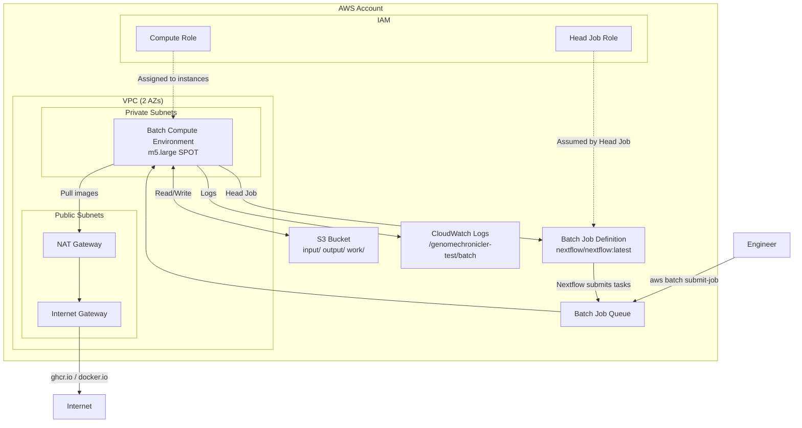

# Design Document: AWS CDK Deployment for GenomeChronicler-nf

## Overview

This design describes the AWS CDK stack that provisions all infrastructure required to run the GenomeChronicler-nf Nextflow pipeline on AWS Batch. The stack targets the **test profile** (4 vCPUs, 6 GB RAM, 2-hour max runtime) and is structured as a single CDK stack written in TypeScript.

The deployment follows the "Nextflow-on-AWS-Batch" pattern: a lightweight **head job** container runs Nextflow itself, which then submits individual pipeline **task jobs** to AWS Batch for parallel execution. Pipeline data flows through S3 (input upload → Batch processing → output retrieval), with CloudWatch providing centralized logging.

An educational **Deployment Guide** (markdown) is produced alongside the CDK code, targeting bioinformatics engineers who may be new to AWS.

### Key Design Decisions

| Decision | Choice | Rationale |
|----------|--------|-----------|
| CDK Language | TypeScript | Most mature CDK support, largest ecosystem of constructs and examples |
| Stack Granularity | Single stack | Test workload is small; a single stack simplifies deployment and teardown |
| Compute Strategy | SPOT instances | Test workload is fault-tolerant; SPOT saves ~70% on compute |
| NAT Gateway Count | 1 (shared) | Cost optimization for test workload; production would use 2+ for HA |
| Pipeline Launcher | Direct Batch job submission via CLI | Simplest mechanism; avoids Step Functions overhead for a test deployment |
| Container Image Source | Direct pull from ghcr.io | Avoids ECR mirror setup; documented as alternative for rate-limited environments |

## Architecture



### Data Flow

1. Engineer uploads samplesheet + input files to `s3://<bucket>/input/`
2. Engineer submits Batch job (head job) via AWS CLI
3. Head job container runs Nextflow with `awsbatch` executor
4. Nextflow submits GenomeChronicler task jobs to the same Batch queue
5. Task jobs pull `ghcr.io/pgp-uk/genomechronicler:latest`, process data from S3
6. Results written to `s3://<bucket>/output/<job-id>/`
7. Working files in `s3://<bucket>/work/<job-id>/` expire after 7 days
8. All container logs route to CloudWatch

## Components and Interfaces

### CDK Project Structure

```
infrastructure/
├── bin/
│   └── app.ts                    # CDK app entry point
├── lib/
│   └── genome-chronicler-stack.ts  # Main stack definition
├── cdk.json                      # CDK configuration
├── package.json                  # Dependencies
├── tsconfig.json                 # TypeScript config
└── test/
    └── genome-chronicler-stack.test.ts  # Snapshot + assertion tests
```

### Stack Construct: `GenomeChroniclerStack`

The stack is implemented as a single `cdk.Stack` subclass containing all resources.

#### Constructor Props Interface

```typescript
interface GenomeChroniclerStackProps extends cdk.StackProps {
  /**
   * Prefix for the S3 bucket name. Max 37 characters.
   * Account ID is appended for global uniqueness.
   */
  bucketPrefix?: string;  // default: "genomechronicler-test"
}
```

#### Resource Construction Order (dependency-driven)

1. **VPC** — no dependencies
2. **S3 Bucket** — no dependencies
3. **IAM Roles** — depends on S3 Bucket ARN
4. **Batch Compute Environment** — depends on VPC, Compute Role
5. **Batch Job Queue** — depends on Compute Environment
6. **Batch Job Definition** — depends on Head Job Role, S3 Bucket
7. **CloudWatch Log Group** — no dependencies (but referenced by IAM policies)
8. **CloudFormation Outputs** — depends on all above

### Component Details

#### 1. VPC Component

```typescript
// Construct: ec2.Vpc
const vpc = new ec2.Vpc(this, 'PipelineVpc', {
  maxAzs: 2,
  ipAddresses: ec2.IpAddresses.cidr('10.0.0.0/16'),
  natGateways: 1,
  subnetConfiguration: [
    { name: 'Public', subnetType: ec2.SubnetType.PUBLIC, cidrMask: 24 },
    { name: 'Private', subnetType: ec2.SubnetType.PRIVATE_WITH_EGRESS, cidrMask: 24 },
  ],
});
```

- 2 AZs, /16 CIDR
- 1 NAT Gateway (cost optimization)
- Private subnets for Batch instances, public subnets for NAT/IGW
- All resources tagged with `Project: genomechronicler-test`

#### 2. S3 Bucket Component

```typescript
// Construct: s3.Bucket
const bucket = new s3.Bucket(this, 'DataBucket', {
  bucketName: `${bucketPrefix}-${cdk.Aws.ACCOUNT_ID}`,
  versioned: true,
  encryption: s3.BucketEncryption.S3_MANAGED,
  blockPublicAccess: s3.BlockPublicAccess.BLOCK_ALL,
  removalPolicy: cdk.RemovalPolicy.RETAIN,
  lifecycleRules: [
    {
      id: 'TransitionToIA',
      prefix: 'input/',
      transitions: [{ storageClass: s3.StorageClass.INFREQUENT_ACCESS, transitionAfter: cdk.Duration.days(30) }],
    },
    {
      id: 'TransitionOutputToIA',
      prefix: 'output/',
      transitions: [{ storageClass: s3.StorageClass.INFREQUENT_ACCESS, transitionAfter: cdk.Duration.days(30) }],
    },
    {
      id: 'ExpireWorkDir',
      prefix: 'work/',
      expiration: cdk.Duration.days(7),
    },
  ],
});
```

- Prefix structure: `input/`, `output/`, `work/`
- Work directory auto-expires after 7 days
- Input/output transitions to IA after 30 days
- RETAIN policy preserves data on stack deletion

#### 3. IAM Roles

**Head Job Role** (`headJobRole`):
- Trust policy: `ecs-tasks.amazonaws.com`
- Permissions:
  - `batch:SubmitJob`, `batch:DescribeJobs`, `batch:ListJobs`, `batch:CancelJob`, `batch:TerminateJob` scoped to Job Queue ARN
  - `s3:GetObject`, `s3:PutObject`, `s3:DeleteObject`, `s3:ListBucket` scoped to S3 Bucket ARN
  - `iam:PassRole` scoped to Compute Role ARN
  - `logs:CreateLogStream`, `logs:PutLogEvents` scoped to Log Group ARN

**Compute Role** (`computeRole`):
- Trust policy: `ec2.amazonaws.com` (instance profile for ECS-optimized AMI)
- Managed policies: `AmazonECSTaskExecutionRolePolicy` (for ECS agent)
- Custom permissions:
  - `ecr-public:GetAuthorizationToken`, `ecr-public:BatchGetImage` (global — service requires `*`)
  - `s3:GetObject`, `s3:PutObject`, `s3:DeleteObject`, `s3:ListBucket` scoped to S3 Bucket ARN
  - `sts:GetServiceBearerToken` (required for ECR public auth)

#### 4. Batch Compute Environment

```typescript
// Construct: batch.ManagedEc2EcsComputeEnvironment
const computeEnv = new batch.ManagedEc2EcsComputeEnvironment(this, 'ComputeEnv', {
  vpc,
  vpcSubnets: { subnetType: ec2.SubnetType.PRIVATE_WITH_EGRESS },
  instanceRole: computeRole,
  instanceTypes: [ec2.InstanceType.of(ec2.InstanceClass.M5, ec2.InstanceSize.LARGE)],
  maxvCpus: 4,
  minvCpus: 0,
  spot: true,
});
```

- m5.large: 2 vCPUs, 8 GB RAM per instance (comfortably covers 6 GB requirement)
- SPOT allocation for cost savings
- Scales to 0 when idle (no ongoing costs)
- Placed in private subnets with NAT gateway egress

#### 5. Batch Job Queue

```typescript
const jobQueue = new batch.JobQueue(this, 'JobQueue', {
  priority: 1,
  computeEnvironments: [{ computeEnvironment: computeEnv, order: 1 }],
});
```

#### 6. Batch Job Definition

```typescript
const jobDefinition = new batch.EcsJobDefinition(this, 'HeadJobDef', {
  container: new batch.EcsEc2ContainerDefinition(this, 'HeadContainer', {
    image: ecs.ContainerImage.fromRegistry('nextflow/nextflow:latest'),
    cpu: 2,
    memory: cdk.Size.mebibytes(4096),
    jobRole: headJobRole,
    environment: {
      NXF_WORK: `s3://${bucket.bucketName}/work/`,
      NXF_OUTPUT: `s3://${bucket.bucketName}/output/`,
    },
    logging: ecs.LogDrivers.awsLogs({
      logGroup,
      streamPrefix: 'nextflow',
    }),
  }),
  timeout: cdk.Duration.seconds(7200),
  retryAttempts: 1,
});
```

- Container: `nextflow/nextflow:latest` (official Nextflow image)
- 2 vCPUs, 4 GB RAM for the head job (orchestration only)
- 2-hour timeout matching test profile
- No retry on failure (retryAttempts: 1 means single attempt)
- Environment variables direct Nextflow to S3 paths

#### 7. CloudWatch Log Group

```typescript
const logGroup = new logs.LogGroup(this, 'PipelineLogGroup', {
  logGroupName: '/genomechronicler-test/batch',
  retention: logs.RetentionDays.TWO_WEEKS,
  removalPolicy: cdk.RemovalPolicy.DESTROY,
});
```

- 14-day retention
- Stream prefix: `nextflow/` for head job, `tasks/` for child tasks
- DESTROY on stack deletion (logs are ephemeral)

#### 8. CloudFormation Outputs

| Output Key | Value | Description |
|------------|-------|-------------|
| `S3BucketName` | Bucket name | Pipeline data storage bucket |
| `BatchJobQueueArn` | Queue ARN | Job submission target |
| `BatchJobDefinitionArn` | Job definition ARN | Head job template |
| `VpcId` | VPC ID | Network environment |
| `LogGroupName` | Log group name | Pipeline execution logs |
| `SampleSubmitCommand` | AWS CLI command | Example job submission command with placeholder |

### Nextflow-on-AWS-Batch Integration Pattern

The head job container runs Nextflow with the following effective command:

```bash
nextflow run /path/to/main.nf \
  --input s3://<bucket>/input/samplesheet.csv \
  --outdir s3://<bucket>/output/<job-id>/ \
  --gc_container ghcr.io/pgp-uk/genomechronicler:latest \
  -profile docker,test \
  -work-dir s3://<bucket>/work/<job-id>/ \
  -process.executor awsbatch \
  -process.queue <job-queue-name> \
  -aws.batch.cliPath /usr/local/bin/aws
```

Nextflow's `awsbatch` executor:
- Submits each `GENOMECHRONICLER_RUN` process as a child Batch job
- Uses the Compute Role for task containers
- Stages input/output data via S3 automatically
- Reports task status back to the head job

### Pipeline Launcher Interface

The Pipeline Launcher is a documented AWS CLI invocation pattern (not a separate AWS resource). The sample command:

```bash
aws batch submit-job \
  --job-name "genomechronicler-$(date +%Y%m%d-%H%M%S)" \
  --job-queue <BatchJobQueueArn> \
  --job-definition <BatchJobDefinitionArn> \
  --container-overrides '{
    "command": [
      "nextflow", "run",
      "https://github.com/<org>/GenomeChronicler26-nextflow",
      "--input", "s3://<bucket>/input/samplesheet.csv",
      "--outdir", "s3://<bucket>/output/",
      "--gc_container", "ghcr.io/pgp-uk/genomechronicler:latest",
      "-profile", "docker,test",
      "-work-dir", "s3://<bucket>/work/",
      "-process.executor", "awsbatch",
      "-process.queue", "<job-queue-name>"
    ]
  }'
```

Input validation (S3 path format `s3://bucket/key`) is performed by a helper script documented in the Deployment Guide. If the path does not match the expected format, the script exits with an error before calling `submit-job`.

## Data Models

### CDK Context Parameters

```typescript
// cdk.json context or -c flag
{
  "bucketPrefix": "genomechronicler-test"  // max 37 chars
}
```

### S3 Bucket Layout

```
s3://<bucket>/
├── input/
│   ├── samplesheet.csv
│   ├── NA12878.g.vcf.gz
│   └── ...
├── output/
│   └── <job-id>/
│       └── <sample_id>/
│           └── results_<sample_id>/
│               ├── <sample_id>_report_<date>.pdf
│               ├── <sample_id>genotypes<date>.xlsx
│               ├── AncestryPlot.pdf
│               └── ...
└── work/
    └── <job-id>/
        └── <nextflow-hash-dirs>/
```

### CloudWatch Log Structure

```
/genomechronicler-test/batch/
├── nextflow/<head-job-id>          # Nextflow orchestration logs
└── tasks/<task-job-id>             # GenomeChronicler process logs
```

### Batch Job Submission Parameters

| Parameter | Type | Required | Default |
|-----------|------|----------|---------|
| `samplesheet_s3_path` | string (s3://bucket/key) | Yes | — |
| `output_prefix` | string (s3://bucket/prefix/) | No | `s3://<bucket>/output/<job-id>/` |
| `work_dir` | string (s3://bucket/prefix/) | No | `s3://<bucket>/work/<job-id>/` |

## Error Handling

### CDK Deployment Errors

| Error | Cause | Resolution |
|-------|-------|------------|
| Bucket name conflict | Prefix + account ID already in use | Change `bucketPrefix` context parameter |
| NAT Gateway limit | Account limit on NAT Gateways | Request limit increase or reuse existing VPC |
| Batch CE creation failure | Insufficient SPOT capacity | Fall back to ON_DEMAND or request capacity |
| IAM role creation denied | Insufficient deployer permissions | Ensure deployer has `iam:CreateRole`, `iam:AttachRolePolicy` |

### Runtime Errors

| Error | Symptom | Resolution |
|-------|---------|------------|
| Container pull failure | Job FAILED, "CannotPullContainerError" | Check NAT gateway connectivity; consider ECR mirror |
| Insufficient memory | Job FAILED, exit code 137 (OOM) | Increase Batch CE max vCPUs or use larger instance type |
| S3 access denied | "AccessDenied" in logs | Verify IAM role policies; check bucket policy |
| SPOT reclamation | Job FAILED, "Host EC2 ... terminated" | Retry job; Nextflow resume handles partial progress |
| Pipeline timeout | Job FAILED after 7200s | Increase timeout or use production profile for larger data |
| Invalid samplesheet path | Launcher rejects submission | Ensure path format: `s3://bucket-name/key/path.csv` |

### Nextflow Resume Strategy

On SPOT reclamation or transient failures:
1. Nextflow's built-in resume (`-resume`) reuses cached results from S3 work directory
2. Re-submit the same job with `-resume` appended to the command
3. Only incomplete tasks re-execute; completed tasks are retrieved from S3 cache

## Correctness Properties

Since this is an Infrastructure as Code (IaC) project using AWS CDK, traditional property-based testing with randomized inputs is not applicable. The CDK stack defines declarative infrastructure configurations rather than functions with variable inputs. The correctness properties below are verified through CDK assertion tests and template inspection.

### Property 1: Network Isolation

All Batch compute instances are placed exclusively in private subnets with no direct internet ingress. Outbound traffic is routed through a NAT gateway. For all deployed compute instances, the security group denies all inbound traffic from outside the VPC while permitting all outbound traffic.

**Validates: Requirements 1.3, 1.5, 3.4**

### Property 2: Least-Privilege IAM

No IAM policy attached to any role in the stack uses `Resource: "*"` except where mandated by AWS service APIs (ecr-public). All S3 permissions are scoped to the specific bucket ARN. All Batch permissions are scoped to the specific job queue and job definition ARNs.

**Validates: Requirements 5.1, 5.2, 5.5, 5.6**

### Property 3: Data Durability

The S3 bucket is configured with versioning enabled, RETAIN removal policy, and server-side encryption. Deletion of the CloudFormation stack does not destroy pipeline data.

**Validates: Requirements 2.2, 2.3, 2.7**

### Property 4: Cost Containment

The compute environment scales to 0 vCPUs when idle (no instances running when no jobs are queued). SPOT instances are used to minimize compute costs. A single NAT gateway is shared across AZs to reduce networking costs.

**Validates: Requirements 1.2, 3.5, 3.7**

### Property 5: Template Determinism

For a given set of CDK context parameters, `cdk synth` produces an identical CloudFormation template on every invocation. The synthesized template contains all expected resources with correct configurations matching the requirements.

**Validates: Requirements 11.1, 11.2, 11.3, 11.4, 11.5**

## Testing Strategy

### Unit Tests (CDK Assertions)

Tests verify that the synthesized CloudFormation template contains the expected resources with correct properties:

| Test Case | Validates |
|-----------|-----------|
| VPC has 2 AZs, 1 NAT Gateway | Requirement 1.1, 1.2 |
| S3 bucket has versioning, SSE-S3, block public access | Requirement 2.2, 2.3, 2.4 |
| S3 lifecycle rules for input/, output/, work/ | Requirement 2.5, 10.1 |
| Batch CE: m5.large, SPOT, maxVcpus=4, minVcpus=0 | Requirement 3.1–3.7 |
| Batch Job Definition: 2 vCPU, 4096 MB, timeout 7200 | Requirement 4.4, 4.5 |
| Head Job Role has scoped S3, Batch, IAM, Logs permissions | Requirement 5.1–5.3, 5.7 |
| Compute Role has S3 and ECR public permissions | Requirement 5.4, 5.5 |
| No wildcard resource ARNs (except required by service APIs) | Requirement 5.6 |
| CloudWatch Log Group: 14-day retention, correct name | Requirement 8.2 |
| All CloudFormation outputs present with descriptions | Requirement 11.1–11.6 |
| Project tag applied to VPC resources | Requirement 1.4 |

### Snapshot Tests

- Capture full synthesized CloudFormation template
- Detect unintended changes during refactoring
- Run on every PR via CI

### Integration Tests (Manual / CI with AWS account)

| Test | Validates |
|------|-----------|
| `cdk deploy` succeeds | Stack is valid and deployable |
| Submit test job with GIAB samplesheet | End-to-end pipeline execution |
| Verify output files in S3 after completion | Pipeline produces expected outputs |
| Verify CloudWatch logs contain head + task streams | Logging configuration works |
| `cdk destroy` removes non-retained resources | Clean teardown |

### Test Tooling

- **Jest** with `aws-cdk-lib/assertions` for unit/snapshot tests
- **CDK CLI** (`cdk synth`, `cdk deploy`) for integration validation
- CI runs snapshot + assertion tests on every commit
- Integration tests run on-demand (require AWS credentials)

### Deployment Guide Validation

The Deployment Guide is validated by:
- Manual review for completeness against requirements 9.1–9.8
- Mermaid diagram rendering verification
- AWS CLI command syntax validation (dry-run where possible)
