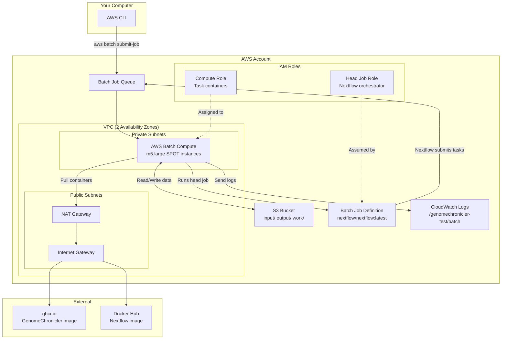

# GenomeChronicler AWS Deployment Guide

## Table of Contents

1. [Prerequisites](#prerequisites)
2. [Architecture Overview](#architecture-overview)
3. [AWS Services Explained](#aws-services-explained)
4. [CDK Deployment (Automated)](#cdk-deployment-automated)
5. [Manual Setup (Step-by-Step)](#manual-setup-step-by-step)
6. [Running the Pipeline](#running-the-pipeline)
7. [Retrieving Results](#retrieving-results)
8. [Monitoring and Logs](#monitoring-and-logs)
9. [Cost Estimation](#cost-estimation)
10. [Work Directory Cleanup](#work-directory-cleanup)
11. [Troubleshooting](#troubleshooting)
12. [ECR Mirror Alternative](#ecr-mirror-alternative)

---

## Prerequisites

### Required Tools

| Tool | Version | Purpose |
|------|---------|---------|
| AWS CLI | >= 2.x | Interact with AWS services |
| AWS CDK | >= 2.150.0 | Deploy infrastructure as code |
| Node.js | >= 18.x | CDK runtime |
| Docker | >= 20.x | Local testing (optional) |
| TypeScript | >= 5.x | CDK project language |

### AWS Account Configuration

- An AWS account with admin or power-user access
- Permissions to create: VPCs, S3 buckets, IAM roles, Batch resources, CloudWatch logs
- A default region configured (`aws configure`)
- CDK bootstrapped in your target account/region

### Assumed Knowledge

- Basic command-line proficiency
- Familiarity with AWS console navigation
- Understanding of what Docker containers are
- Basic understanding of genomics file formats (BAM, VCF) is helpful but not required

---

## Architecture Overview



### Data Flow (How a Pipeline Run Works)

1. You upload your samplesheet and input files (gVCF/BAM) to `s3://<bucket>/input/`
2. You submit a Batch job using the AWS CLI
3. The head job container (Nextflow) starts and reads your samplesheet from S3
4. Nextflow submits individual GenomeChronicler tasks as separate Batch jobs
5. Each task pulls the GenomeChronicler Docker image and processes your data
6. Results are written to `s3://<bucket>/output/`
7. Intermediate files in `s3://<bucket>/work/` auto-expire after 7 days
8. All logs are available in CloudWatch under `/genomechronicler-test/batch`

---

## AWS Services Explained

### VPC (Virtual Private Cloud)

**What it is:** A logically isolated network within AWS where your compute resources run.

**Why we need it:** Batch instances need network access to pull Docker images from the internet (ghcr.io, Docker Hub) and communicate with AWS services (S3, CloudWatch). The VPC provides:
- **Private subnets**: Where Batch instances run (no direct internet access from outside)
- **Public subnets**: Where the NAT gateway sits
- **NAT Gateway**: Allows private instances to reach the internet (for container pulls) without being directly accessible from the internet

**Cost implication:** NAT Gateway costs ~$0.045/hour + $0.045/GB data processed.

### S3 (Simple Storage Service)

**What it is:** Object storage for your pipeline data.

**Why we need it:** Nextflow on AWS Batch uses S3 as the shared filesystem. All input data, intermediate working files, and output results flow through S3. The bucket is organized into three prefixes:
- `input/` — Your samplesheets and source genomic files
- `output/` — Pipeline results (PDF reports, ancestry plots, genotype tables)
- `work/` — Nextflow intermediate files (auto-expire after 7 days)

### AWS Batch

**What it is:** A managed service that runs containerized workloads on EC2 instances.

**Why we need it:** Nextflow's `awsbatch` executor submits each pipeline process as a Batch job. Batch handles:
- **Compute Environment**: Provisions and terminates EC2 instances on demand
- **Job Queue**: Holds submitted jobs until compute capacity is available
- **Job Definition**: Template for how to run a container (image, CPU, memory, timeout)

We use SPOT instances (~70% cheaper than on-demand) since the test workload is fault-tolerant.

### IAM (Identity and Access Management)

**What it is:** AWS's permission system.

**Why we need two roles:**
- **Head Job Role**: The Nextflow orchestrator needs to submit Batch jobs, read/write S3, and write logs
- **Compute Role**: The EC2 instances need to pull Docker images and access S3 for data staging

Both roles follow "least privilege" — they can only do what's strictly necessary.

### CloudWatch Logs

**What it is:** Centralized log storage.

**Why we need it:** When a pipeline fails, you need logs to understand why. All container stdout/stderr is captured here with a 14-day retention period. Log streams are prefixed with `nextflow/` (head job) and `tasks/` (GenomeChronicler processes).

---

## CDK Deployment (Automated)

This is the recommended approach. The CDK stack provisions everything in one command.

### Step 1: Bootstrap CDK (first time only)

```bash
cd infrastructure
npm install

# Bootstrap CDK in your target account/region
npx cdk bootstrap aws://ACCOUNT_ID/REGION
```

Replace `ACCOUNT_ID` with your 12-digit AWS account ID and `REGION` with your target region (e.g., `eu-west-1`).

### Step 2: Review what will be created

```bash
npx cdk diff
```

This shows you exactly what resources will be created without actually creating them.

### Step 3: Deploy

```bash
npx cdk deploy
```

CDK will ask for confirmation before creating IAM resources. Type `y` to proceed.

### Step 4: Note the outputs

After deployment, CDK prints the CloudFormation outputs:

```
Outputs:
GenomeChroniclerTestStack.S3BucketName = genomechronicler-test-123456789012
GenomeChroniclerTestStack.BatchJobQueueArn = arn:aws:batch:...
GenomeChroniclerTestStack.BatchJobDefinitionArn = arn:aws:batch:...
GenomeChroniclerTestStack.VpcId = vpc-0abc123...
GenomeChroniclerTestStack.LogGroupName = /genomechronicler-test/batch
GenomeChroniclerTestStack.SampleSubmitCommand = aws batch submit-job ...
```

Save these — you'll need them to run the pipeline.

### Step 5: Tear down (when done)

```bash
npx cdk destroy
```

> **Note:** The S3 bucket has a RETAIN policy. It will NOT be deleted even if you destroy the stack. This is intentional — your pipeline data is preserved. Delete the bucket manually via `aws s3 rb` if needed.

---

## Manual Setup (Step-by-Step)

If you prefer to understand each component or can't use CDK, follow these steps in order. Each step depends on the previous ones.

### Step 1: Create the VPC

```bash
# Create VPC
VPC_ID=$(aws ec2 create-vpc \
  --cidr-block 10.0.0.0/16 \
  --tag-specifications 'ResourceType=vpc,Tags=[{Key=Name,Value=genomechronicler-vpc},{Key=Project,Value=genomechronicler-test}]' \
  --query 'Vpc.VpcId' --output text)

# Enable DNS hostnames (required for Batch)
aws ec2 modify-vpc-attribute --vpc-id $VPC_ID --enable-dns-hostnames '{"Value":true}'

# Create Internet Gateway
IGW_ID=$(aws ec2 create-internet-gateway \
  --tag-specifications 'ResourceType=internet-gateway,Tags=[{Key=Project,Value=genomechronicler-test}]' \
  --query 'InternetGateway.InternetGatewayId' --output text)
aws ec2 attach-internet-gateway --vpc-id $VPC_ID --internet-gateway-id $IGW_ID

# Create public subnet (AZ-a)
PUBLIC_SUBNET=$(aws ec2 create-subnet \
  --vpc-id $VPC_ID --cidr-block 10.0.0.0/24 \
  --availability-zone ${AWS_REGION}a \
  --tag-specifications 'ResourceType=subnet,Tags=[{Key=Name,Value=gc-public-a},{Key=Project,Value=genomechronicler-test}]' \
  --query 'Subnet.SubnetId' --output text)

# Create private subnet (AZ-a)
PRIVATE_SUBNET=$(aws ec2 create-subnet \
  --vpc-id $VPC_ID --cidr-block 10.0.1.0/24 \
  --availability-zone ${AWS_REGION}a \
  --tag-specifications 'ResourceType=subnet,Tags=[{Key=Name,Value=gc-private-a},{Key=Project,Value=genomechronicler-test}]' \
  --query 'Subnet.SubnetId' --output text)

# Allocate Elastic IP for NAT Gateway
EIP_ALLOC=$(aws ec2 allocate-address --domain vpc --query 'AllocationId' --output text)

# Create NAT Gateway in public subnet
NAT_ID=$(aws ec2 create-nat-gateway \
  --subnet-id $PUBLIC_SUBNET --allocation-id $EIP_ALLOC \
  --tag-specifications 'ResourceType=natgateway,Tags=[{Key=Project,Value=genomechronicler-test}]' \
  --query 'NatGateway.NatGatewayId' --output text)

# Wait for NAT Gateway to be available
aws ec2 wait nat-gateway-available --nat-gateway-ids $NAT_ID

# Create and configure route tables
PUBLIC_RT=$(aws ec2 create-route-table --vpc-id $VPC_ID --query 'RouteTable.RouteTableId' --output text)
aws ec2 create-route --route-table-id $PUBLIC_RT --destination-cidr-block 0.0.0.0/0 --gateway-id $IGW_ID
aws ec2 associate-route-table --route-table-id $PUBLIC_RT --subnet-id $PUBLIC_SUBNET

PRIVATE_RT=$(aws ec2 create-route-table --vpc-id $VPC_ID --query 'RouteTable.RouteTableId' --output text)
aws ec2 create-route --route-table-id $PRIVATE_RT --destination-cidr-block 0.0.0.0/0 --nat-gateway-id $NAT_ID
aws ec2 associate-route-table --route-table-id $PRIVATE_RT --subnet-id $PRIVATE_SUBNET
```

### Step 2: Create the S3 Bucket

```bash
BUCKET_NAME="genomechronicler-test-$(aws sts get-caller-identity --query Account --output text)"

aws s3api create-bucket \
  --bucket $BUCKET_NAME \
  --region $AWS_REGION \
  --create-bucket-configuration LocationConstraint=$AWS_REGION

# Enable versioning
aws s3api put-bucket-versioning \
  --bucket $BUCKET_NAME \
  --versioning-configuration Status=Enabled

# Block all public access
aws s3api put-public-access-block \
  --bucket $BUCKET_NAME \
  --public-access-block-configuration \
    BlockPublicAcls=true,IgnorePublicAcls=true,BlockPublicPolicy=true,RestrictPublicBuckets=true

# Enable SSE-S3 encryption
aws s3api put-bucket-encryption \
  --bucket $BUCKET_NAME \
  --server-side-encryption-configuration '{
    "Rules": [{"ApplyServerSideEncryptionByDefault": {"SSEAlgorithm": "AES256"}}]
  }'

# Add lifecycle rules
aws s3api put-bucket-lifecycle-configuration \
  --bucket $BUCKET_NAME \
  --lifecycle-configuration '{
    "Rules": [
      {
        "ID": "TransitionInputToIA",
        "Filter": {"Prefix": "input/"},
        "Status": "Enabled",
        "Transitions": [{"Days": 30, "StorageClass": "STANDARD_IA"}]
      },
      {
        "ID": "TransitionOutputToIA",
        "Filter": {"Prefix": "output/"},
        "Status": "Enabled",
        "Transitions": [{"Days": 30, "StorageClass": "STANDARD_IA"}]
      },
      {
        "ID": "ExpireWorkDir",
        "Filter": {"Prefix": "work/"},
        "Status": "Enabled",
        "Expiration": {"Days": 7}
      }
    ]
  }'
```

### Step 3: Create IAM Roles

```bash
# Create Compute Role (for EC2 instances running containers)
aws iam create-role \
  --role-name gc-test-compute-role \
  --assume-role-policy-document '{
    "Version": "2012-10-17",
    "Statement": [{
      "Effect": "Allow",
      "Principal": {"Service": ["ec2.amazonaws.com", "ecs-tasks.amazonaws.com"]},
      "Action": "sts:AssumeRole"
    }]
  }'

# Attach ECS managed policy
aws iam attach-role-policy \
  --role-name gc-test-compute-role \
  --policy-arn arn:aws:iam::aws:policy/service-role/AmazonEC2ContainerServiceforEC2Role

# Add S3 + ECR public permissions
aws iam put-role-policy \
  --role-name gc-test-compute-role \
  --policy-name ComputePermissions \
  --policy-document "{
    \"Version\": \"2012-10-17\",
    \"Statement\": [
      {
        \"Effect\": \"Allow\",
        \"Action\": [\"s3:GetObject\", \"s3:PutObject\", \"s3:DeleteObject\"],
        \"Resource\": \"arn:aws:s3:::${BUCKET_NAME}/*\"
      },
      {
        \"Effect\": \"Allow\",
        \"Action\": [\"s3:ListBucket\"],
        \"Resource\": \"arn:aws:s3:::${BUCKET_NAME}\"
      },
      {
        \"Effect\": \"Allow\",
        \"Action\": [\"ecr-public:GetAuthorizationToken\", \"ecr-public:BatchGetImage\", \"sts:GetServiceBearerToken\"],
        \"Resource\": \"*\"
      }
    ]
  }"

# Create instance profile for Batch
aws iam create-instance-profile --instance-profile-name gc-test-compute-profile
aws iam add-role-to-instance-profile \
  --instance-profile-name gc-test-compute-profile \
  --role-name gc-test-compute-role

# Create Head Job Role (for the Nextflow orchestrator container)
aws iam create-role \
  --role-name gc-test-head-job-role \
  --assume-role-policy-document '{
    "Version": "2012-10-17",
    "Statement": [{
      "Effect": "Allow",
      "Principal": {"Service": "ecs-tasks.amazonaws.com"},
      "Action": "sts:AssumeRole"
    }]
  }'

COMPUTE_ROLE_ARN=$(aws iam get-role --role-name gc-test-compute-role --query 'Role.Arn' --output text)

aws iam put-role-policy \
  --role-name gc-test-head-job-role \
  --policy-name HeadJobPermissions \
  --policy-document "{
    \"Version\": \"2012-10-17\",
    \"Statement\": [
      {
        \"Effect\": \"Allow\",
        \"Action\": [\"s3:GetObject\", \"s3:PutObject\", \"s3:DeleteObject\"],
        \"Resource\": \"arn:aws:s3:::${BUCKET_NAME}/*\"
      },
      {
        \"Effect\": \"Allow\",
        \"Action\": [\"s3:ListBucket\"],
        \"Resource\": \"arn:aws:s3:::${BUCKET_NAME}\"
      },
      {
        \"Effect\": \"Allow\",
        \"Action\": [\"batch:SubmitJob\", \"batch:DescribeJobs\", \"batch:ListJobs\", \"batch:CancelJob\", \"batch:TerminateJob\"],
        \"Resource\": \"*\"
      },
      {
        \"Effect\": \"Allow\",
        \"Action\": [\"iam:PassRole\"],
        \"Resource\": \"${COMPUTE_ROLE_ARN}\"
      },
      {
        \"Effect\": \"Allow\",
        \"Action\": [\"logs:CreateLogStream\", \"logs:PutLogEvents\"],
        \"Resource\": \"arn:aws:logs:${AWS_REGION}:$(aws sts get-caller-identity --query Account --output text):log-group:/genomechronicler-test/batch:*\"
      }
    ]
  }"
```

### Step 4: Create CloudWatch Log Group

```bash
aws logs create-log-group --log-group-name /genomechronicler-test/batch
aws logs put-retention-policy \
  --log-group-name /genomechronicler-test/batch \
  --retention-in-days 14
```

### Step 5: Create Batch Compute Environment

```bash
# Create a security group for Batch instances
SG_ID=$(aws ec2 create-security-group \
  --group-name gc-test-batch-sg \
  --description "Security group for GenomeChronicler Batch instances" \
  --vpc-id $VPC_ID \
  --query 'GroupId' --output text)

# Allow all outbound, deny all inbound (default)
aws ec2 authorize-security-group-egress \
  --group-id $SG_ID \
  --protocol -1 --cidr 0.0.0.0/0 2>/dev/null || true

aws batch create-compute-environment \
  --compute-environment-name gc-test-compute-env \
  --type MANAGED \
  --compute-resources "{
    \"type\": \"SPOT\",
    \"minvCpus\": 0,
    \"maxvCpus\": 4,
    \"instanceTypes\": [\"m5.large\"],
    \"subnets\": [\"${PRIVATE_SUBNET}\"],
    \"securityGroupIds\": [\"${SG_ID}\"],
    \"instanceRole\": \"arn:aws:iam::$(aws sts get-caller-identity --query Account --output text):instance-profile/gc-test-compute-profile\"
  }"

# Wait for compute environment to be VALID
echo "Waiting for compute environment to become VALID..."
aws batch describe-compute-environments \
  --compute-environments gc-test-compute-env \
  --query 'computeEnvironments[0].status'
```

### Step 6: Create Batch Job Queue

```bash
aws batch create-job-queue \
  --job-queue-name gc-test-job-queue \
  --priority 1 \
  --compute-environment-order '[{"order": 1, "computeEnvironment": "gc-test-compute-env"}]'
```

### Step 7: Create Batch Job Definition

```bash
HEAD_JOB_ROLE_ARN=$(aws iam get-role --role-name gc-test-head-job-role --query 'Role.Arn' --output text)
ACCOUNT_ID=$(aws sts get-caller-identity --query Account --output text)

aws batch register-job-definition \
  --job-definition-name gc-test-nextflow-head \
  --type container \
  --container-properties "{
    \"image\": \"nextflow/nextflow:latest\",
    \"resourceRequirements\": [
      {\"type\": \"VCPU\", \"value\": \"2\"},
      {\"type\": \"MEMORY\", \"value\": \"4096\"}
    ],
    \"jobRoleArn\": \"${HEAD_JOB_ROLE_ARN}\",
    \"environment\": [
      {\"name\": \"NXF_WORK\", \"value\": \"s3://${BUCKET_NAME}/work/\"},
      {\"name\": \"NXF_OUTPUT\", \"value\": \"s3://${BUCKET_NAME}/output/\"},
      {\"name\": \"NXF_EXECUTOR\", \"value\": \"awsbatch\"},
      {\"name\": \"NXF_QUEUE\", \"value\": \"gc-test-job-queue\"}
    ],
    \"logConfiguration\": {
      \"logDriver\": \"awslogs\",
      \"options\": {
        \"awslogs-group\": \"/genomechronicler-test/batch\",
        \"awslogs-stream-prefix\": \"nextflow\"
      }
    }
  }" \
  --timeout '{"attemptDurationSeconds": 7200}' \
  --retry-strategy '{"attempts": 1}'
```

---

## Running the Pipeline

### Step 1: Upload Input Data

```bash
# Set your bucket name (from CDK outputs or manual setup)
BUCKET_NAME="genomechronicler-test-123456789012"  # Replace with your actual bucket

# Upload your samplesheet
aws s3 cp samplesheet.csv s3://${BUCKET_NAME}/input/samplesheet.csv

# Upload your gVCF or BAM file(s)
aws s3 cp NA12878.g.vcf.gz s3://${BUCKET_NAME}/input/NA12878.g.vcf.gz
```

Your samplesheet should reference S3 paths:

```csv
sample,bam,vcf,vep
NA12878,,s3://genomechronicler-test-123456789012/input/NA12878.g.vcf.gz,
```

### Step 2: Submit Pipeline Job

```bash
# Get resource ARNs (from CDK outputs or manual setup)
JOB_QUEUE_ARN="arn:aws:batch:REGION:ACCOUNT:job-queue/gc-test-job-queue"
JOB_DEF_ARN="arn:aws:batch:REGION:ACCOUNT:job-definition/gc-test-nextflow-head:1"

aws batch submit-job \
  --job-name "genomechronicler-$(date +%Y%m%d-%H%M%S)" \
  --job-queue "${JOB_QUEUE_ARN}" \
  --job-definition "${JOB_DEF_ARN}" \
  --container-overrides '{
    "command": [
      "nextflow", "run",
      "https://github.com/PGP-UK/GenomeChronicler26-nextflow",
      "--input", "s3://'"${BUCKET_NAME}"'/input/samplesheet.csv",
      "--outdir", "s3://'"${BUCKET_NAME}"'/output/",
      "--gc_container", "ghcr.io/pgp-uk/genomechronicler:latest",
      "-profile", "docker,test",
      "-work-dir", "s3://'"${BUCKET_NAME}"'/work/"
    ]
  }'
```

The command returns a job ID. Save it:

```json
{
    "jobArn": "arn:aws:batch:eu-west-1:123456789012:job/abc123-def456",
    "jobName": "genomechronicler-20240115-143022",
    "jobId": "abc123-def456-ghi789"
}
```

### Step 3: Monitor Job Status

```bash
JOB_ID="abc123-def456-ghi789"  # Replace with your job ID

# Check status
aws batch describe-jobs --jobs $JOB_ID \
  --query 'jobs[0].{status:status,reason:statusReason,started:startedAt}' \
  --output table

# Watch until completion (poll every 30 seconds)
while true; do
  STATUS=$(aws batch describe-jobs --jobs $JOB_ID --query 'jobs[0].status' --output text)
  echo "$(date): $STATUS"
  if [[ "$STATUS" == "SUCCEEDED" || "$STATUS" == "FAILED" ]]; then break; fi
  sleep 30
done
```

---

## Retrieving Results

After the pipeline completes successfully:

```bash
# List output files
aws s3 ls s3://${BUCKET_NAME}/output/ --recursive

# Download all results to a local directory
aws s3 sync s3://${BUCKET_NAME}/output/ ./results/

# Download just the PDF report
aws s3 cp s3://${BUCKET_NAME}/output/NA12878/results_NA12878/NA12878_report_*.pdf ./
```

Expected output structure:

```
output/
└── <sample_id>/
    └── results_<sample_id>/
        ├── <sample_id>_report_<date>.pdf      ← Main genome report
        ├── <sample_id>genotypes<date>.xlsx     ← Genotype tables
        ├── AncestryPlot.pdf                    ← Ancestry PCA plot
        ├── SampleName.txt
        └── <sample_id>.processingLog.stderr.txt
```

---

## Monitoring and Logs

### View Logs in CloudWatch

```bash
# List recent log streams for the head job
aws logs describe-log-streams \
  --log-group-name /genomechronicler-test/batch \
  --log-stream-name-prefix nextflow/ \
  --order-by LastEventTime --descending \
  --limit 5

# Tail logs from a specific stream
aws logs tail /genomechronicler-test/batch \
  --log-stream-names "nextflow/<job-id>" \
  --follow

# Search across all streams for errors
aws logs filter-log-events \
  --log-group-name /genomechronicler-test/batch \
  --filter-pattern "ERROR" \
  --start-time $(date -d '1 hour ago' +%s000)
```

### Log Stream Structure

| Prefix | Contains |
|--------|----------|
| `nextflow/` | Nextflow orchestration logs (pipeline progress, task submission) |
| `tasks/` | GenomeChronicler process logs (samtools, bcftools, GATK output) |

---

## Cost Estimation

Estimated cost for a single test pipeline run (1 sample, gVCF input, ~30 min runtime):

| Service | Cost | Notes |
|---------|------|-------|
| EC2 SPOT (m5.large) | ~$0.03 | 30 min at ~$0.05/hr SPOT price |
| NAT Gateway | ~$0.07 | $0.045/hr for ~1.5 hr (instance startup + run) |
| NAT Data Transfer | ~$0.05 | ~1 GB container pulls at $0.045/GB |
| S3 Storage | ~$0.01 | Few GB for work + output, mostly short-lived |
| S3 Requests | ~$0.01 | PUT/GET requests |
| CloudWatch Logs | ~$0.01 | Small volume of logs |
| **Total per run** | **~$0.18** | |

**Ongoing costs when idle:** ~$1.08/day for the NAT Gateway (even with no jobs running). To avoid this, tear down the stack when not in use.

> **Tip:** The NAT Gateway is the most expensive idle component. For development, you could destroy and redeploy the stack each time you need it. The S3 bucket (RETAIN policy) survives stack deletion, so your data is safe.

---

## Work Directory Cleanup

### Automatic Cleanup

The S3 lifecycle rule automatically expires all objects under `work/` after 7 days. This is a safety net that prevents intermediate files from accumulating indefinitely.

### Manual Cleanup After a Successful Run

To immediately free up space after a successful run:

```bash
# Use nextflow clean to remove work directory
nextflow clean -f s3://${BUCKET_NAME}/work/

# Or use AWS CLI to delete directly
aws s3 rm s3://${BUCKET_NAME}/work/ --recursive
```

### Inspecting Work Directory Before Cleanup

If a run failed and you want to inspect intermediate files:

```bash
# List work directory contents
aws s3 ls s3://${BUCKET_NAME}/work/ --recursive | head -50

# Download a specific work directory for debugging
aws s3 sync s3://${BUCKET_NAME}/work/ab/cd1234... ./debug-work/
```

### Retaining Work Directory

If you need to keep the work directory beyond 7 days (e.g., for a Nextflow `-resume`):

```bash
# Copy work directory to a permanent location
aws s3 sync s3://${BUCKET_NAME}/work/ s3://${BUCKET_NAME}/output/preserved-work/
```

---

## Troubleshooting

### Container Pull Failure

**Symptom:** Job status is `FAILED` with reason containing `CannotPullContainerError`.

**Likely cause:** The Batch instance cannot reach ghcr.io or Docker Hub. This happens when:
- NAT Gateway is misconfigured or deleted
- Security group blocks outbound traffic
- Docker Hub/GHCR rate limits are hit (anonymous pulls are limited)

**Resolution:**
1. Verify NAT Gateway exists and is in `available` state:
   ```bash
   aws ec2 describe-nat-gateways --filter Name=tag:Project,Values=genomechronicler-test
   ```
2. Check the route table for private subnets points to the NAT Gateway
3. If rate-limited, see the [ECR Mirror Alternative](#ecr-mirror-alternative) section

### Insufficient Resources / Out of Memory

**Symptom:** Job fails with exit code 137 (OOM killed) or never starts (stuck in RUNNABLE).

**Likely cause:**
- Exit code 137: Container exceeded its memory allocation
- Stuck in RUNNABLE: No instances available (SPOT capacity or vCPU limit reached)

**Resolution:**
- For OOM: The test profile should work for small gVCF files. If using BAM input, you may need more memory. Switch to production profile or increase `max_memory` in nextflow.config.
- For RUNNABLE: Check `maxvCpus` in the compute environment. For larger workloads, increase beyond 4.
  ```bash
  aws batch update-compute-environment \
    --compute-environment gc-test-compute-env \
    --compute-resources '{"maxvCpus": 8}'
  ```

### IAM Permission Errors

**Symptom:** `AccessDenied` errors in CloudWatch logs, or Nextflow fails to submit child jobs.

**Likely cause:** IAM role policies are misconfigured or the role ARN reference is wrong.

**Resolution:**
1. Check which role is failing (head job role vs compute role)
2. Verify the role policies:
   ```bash
   aws iam get-role-policy --role-name gc-test-head-job-role --policy-name HeadJobPermissions
   ```
3. Ensure the bucket name in the policy matches your actual bucket
4. For "PassRole" errors: verify the compute role ARN in the head job role policy matches

### SPOT Instance Reclamation

**Symptom:** Job fails mid-execution with reason "Host EC2 instance ... terminated".

**Likely cause:** AWS reclaimed the SPOT instance (normal behavior — you bid for cheap instances, AWS can take them back).

**Resolution:** Nextflow handles this gracefully with `-resume`:
```bash
# Re-submit the same job with -resume flag appended
aws batch submit-job \
  --job-name "genomechronicler-resume-$(date +%Y%m%d-%H%M%S)" \
  --job-queue "${JOB_QUEUE_ARN}" \
  --job-definition "${JOB_DEF_ARN}" \
  --container-overrides '{
    "command": [
      "nextflow", "run",
      "https://github.com/PGP-UK/GenomeChronicler26-nextflow",
      "--input", "s3://'"${BUCKET_NAME}"'/input/samplesheet.csv",
      "--outdir", "s3://'"${BUCKET_NAME}"'/output/",
      "--gc_container", "ghcr.io/pgp-uk/genomechronicler:latest",
      "-profile", "docker,test",
      "-work-dir", "s3://'"${BUCKET_NAME}"'/work/",
      "-resume"
    ]
  }'
```

Nextflow will reuse cached results from the work directory and only re-run incomplete tasks.

### Pipeline Timeout

**Symptom:** Job fails after exactly 7200 seconds (2 hours).

**Likely cause:** The test profile has a 2-hour max runtime. Large BAM files may exceed this.

**Resolution:**
- For the test profile, use gVCF input instead of BAM (skips the slow GATK HaplotypeCaller step)
- For larger workloads, create a new job definition with a longer timeout:
  ```bash
  # Re-register with 8-hour timeout
  aws batch register-job-definition \
    --job-definition-name gc-test-nextflow-head-extended \
    --type container \
    --timeout '{"attemptDurationSeconds": 28800}' \
    ...
  ```

---

## ECR Mirror Alternative

If you experience Docker Hub or GHCR rate limiting (common in shared AWS accounts), you can mirror the container images to Amazon ECR.

### Step 1: Create ECR Repositories

```bash
aws ecr create-repository --repository-name genomechronicler
aws ecr create-repository --repository-name nextflow
```

### Step 2: Pull and Push Images

```bash
# Login to ECR
ECR_URI="${ACCOUNT_ID}.dkr.ecr.${AWS_REGION}.amazonaws.com"
aws ecr get-login-password | docker login --username AWS --password-stdin $ECR_URI

# Pull from GHCR and push to ECR
docker pull ghcr.io/pgp-uk/genomechronicler:latest
docker tag ghcr.io/pgp-uk/genomechronicler:latest ${ECR_URI}/genomechronicler:latest
docker push ${ECR_URI}/genomechronicler:latest

docker pull nextflow/nextflow:latest
docker tag nextflow/nextflow:latest ${ECR_URI}/nextflow:latest
docker push ${ECR_URI}/nextflow:latest
```

### Step 3: Update Job Definition

Update the container image references in your job definition and pipeline parameters to use the ECR URIs instead of ghcr.io / Docker Hub.

---

## Quick Reference

### Key Environment Variables for Nextflow on AWS Batch

| Variable | Purpose |
|----------|---------|
| `NXF_WORK` | S3 path for intermediate working files |
| `NXF_OUTPUT` | S3 path for final output |
| `NXF_EXECUTOR` | Set to `awsbatch` for AWS Batch execution |
| `NXF_QUEUE` | Batch job queue name for task submission |

### Useful Commands

```bash
# Check stack outputs
aws cloudformation describe-stacks \
  --stack-name GenomeChroniclerTestStack \
  --query 'Stacks[0].Outputs'

# List running Batch jobs
aws batch list-jobs --job-queue gc-test-job-queue --job-status RUNNING

# Cancel a job
aws batch cancel-job --job-id <job-id> --reason "Manual cancellation"

# Check compute environment capacity
aws batch describe-compute-environments \
  --compute-environments gc-test-compute-env \
  --query 'computeEnvironments[0].computeResources'
```
